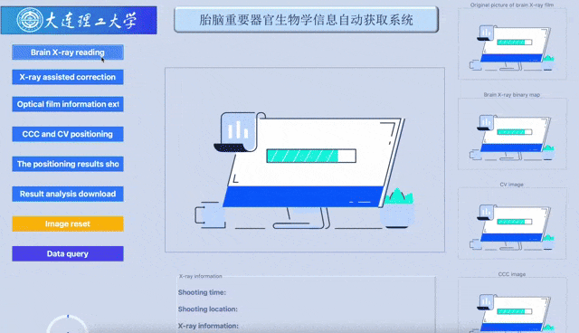

# Intelligent Recognition System for Prenatal Ultrasound Images (IRSPUI)

:smiley: *Welcome to IRSPUI!*  

**IRSPUI** is a software tool designed to assist doctors during prenatal ultrasound examinations.  
It integrates **deep learning**, **OCR (Optical Character Recognition)**, **PDF report generation**, and **clinical data management** into one system.

---

## Features

- **User-friendly GUI** for doctors and administrators.
- **Automated image enhancement and segmentation**:
  - Super-resolution reconstruction (SPIN).
  - Cavum Septum Pellucidum Complex (CCSP) & Cerebellar Vermis（CV）segmentation .
  - Image correction (YOLOv8-based keypoint detection for ultrasound images).
- **OCR text recognition** via Tesseract.
- **Report generation** (PDF export).
- **Integrated user and image database** (with `pySql`).

---

## Installation

This app runs on **Python 3.8** (Windows recommended).  
```bash
conda create -n prenatal python=3.8
conda activate prenatal
cd ./environment
pip install -r requirements.txt
```
Install PyTorch & TorchVision (CPU version for Windows):
```bash
pip install torch-1.10.0+cpu-cp38-cp38-win_amd64.whl
pip install torchvision-0.11.0+cpu-cp38-cp38-win_amd64.whl
```
Install Tesseract OCR:
```bash
pip install pytesseract
```
Then edit pytesseract.py to set the path to:
```bash
tesseract_cmd = r'.\Tesseract-OCR\tesseract'
```
---

## Usage

Run the main application:
```bash
python main.py
```
You will be prompted with a login screen.
Default login accounts:
```bash
	•	Administrator: admin / 123456
	•	Doctor: jzpei / 123456
```
Note: Avoid using Chinese characters in file paths when importing images.

---

## Output & Logs

During usage, the system will generate:
	•	save/: Exported results (images, reports).
	•	log/: Operation logs.
	•	head/: User avatar images.

---

## Demo
<p align="center">
  
</p>

---

## Citation

If you use this work, please cite:

```bibtex
@article{wang2025fbzwunet,
  title={FB-ZWUNet: A deep learning network for corpus callosum segmentation in fetal brain ultrasound images for prenatal diagnostics},
  author={Wang, Qifeng and Zhao, Dan and Ma, Hao and Liu, Bin},
  journal={Biomedical Signal Processing and Control},
  volume={104},
  pages={107499},
  year={2025},
  doi={10.1016/j.bspc.2025.107499}
}

@article{wang2023ccpcvsegmentation,
  title={A method framework of automatic localization and quantitative segmentation for the cavum septum pellucidum complex and the cerebellar vermis in fetal brain ultrasound images},
  author={Wang, Qifeng and Pei, Jingjing and Ouyang, Jian and Chen, Yu and Pu, Jingyu and Humayun, Awais and Zhao, Dongdong and Liu, Bin},
  journal={Quantitative Imaging in Medicine and Surgery},
  volume={13},
  number={9},
  pages={6059--6088},
  year={2023},
  doi={10.21037/qims-22-1242}
}
```

---

## Contact
For **data requests, academic collaborations, or presentation materials**:  
- **Email**: [wqf970702@mail.dlut.edu.cn](mailto:wqf970702@mail.dlut.edu.cn)  
- **ResearchGate**: [Qifeng Wang](https://www.researchgate.net/profile/Qifeng-Wang-9?ev=hdr_xprf)

---

## Acknowledgment

Special thanks to **Pei Jingjing** and **Ma Hao** for their significant contributions to the development of this application.


